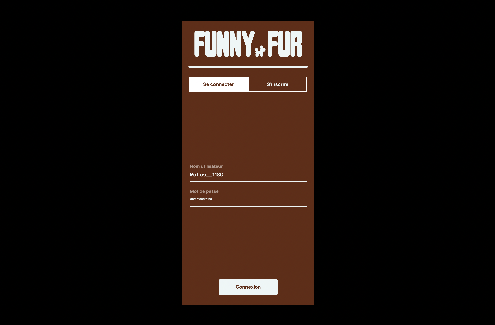
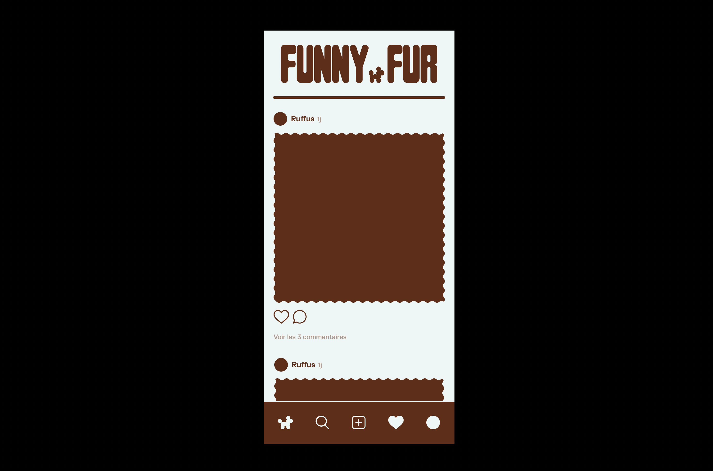
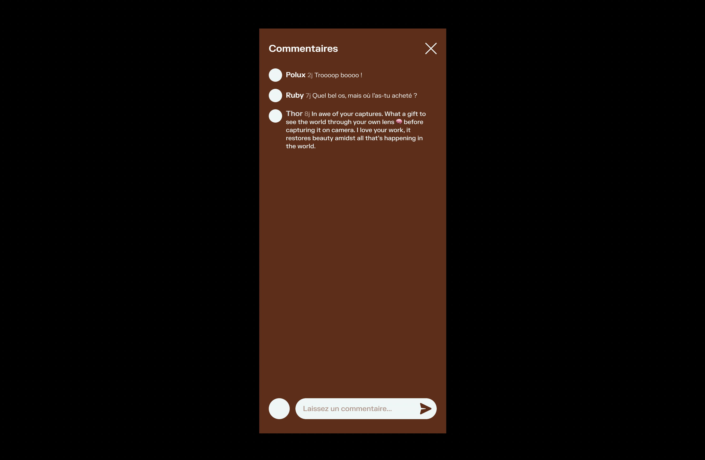
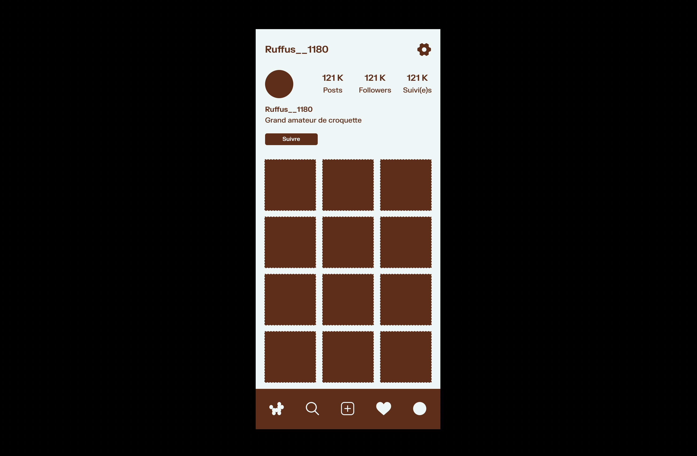
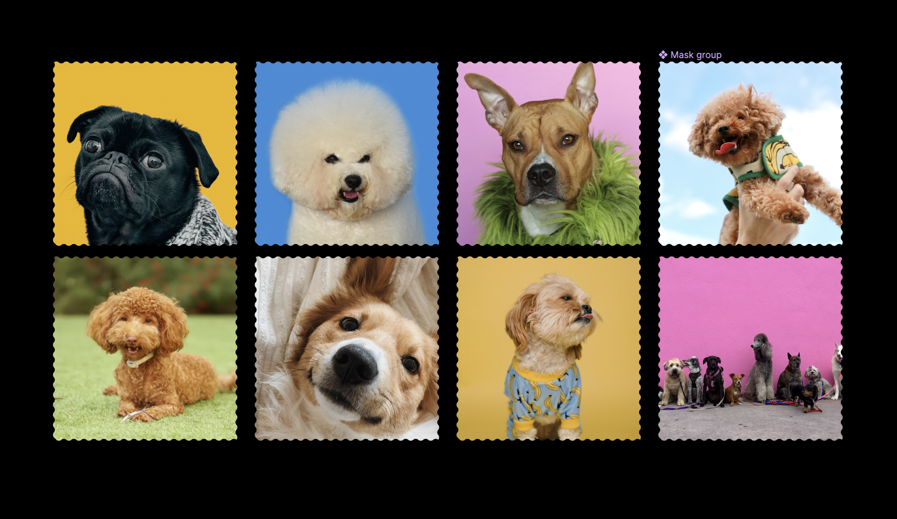

# FUNNY FUR 🐈🦋🦜🐕🪱🦢🐝

Funny Fur est une plateforme de partage d'image dédié aux animaux de compagnie en tout genre :-)

## ⏰ ÉTAT D'AVANCEMENT

En cours de création…
Pas de version desktop pour le moment.

## 🔗 LIEN PROJET

Version mobile :
[https://funnyfur.onrender.com/](https://funnyfur.onrender.com/)

## 🌐 LANGUAGE UTILISÉ

- React
- React router
- Express
- Axios
- Tailwind
- Node.js

## ÉQUIPE

...

## 👀 MAQUETTE DU PROJET







## 💾 INSTALLATION

```js
cd server
npm i
npm run dev

cd client
npm i
npm run dev
```
